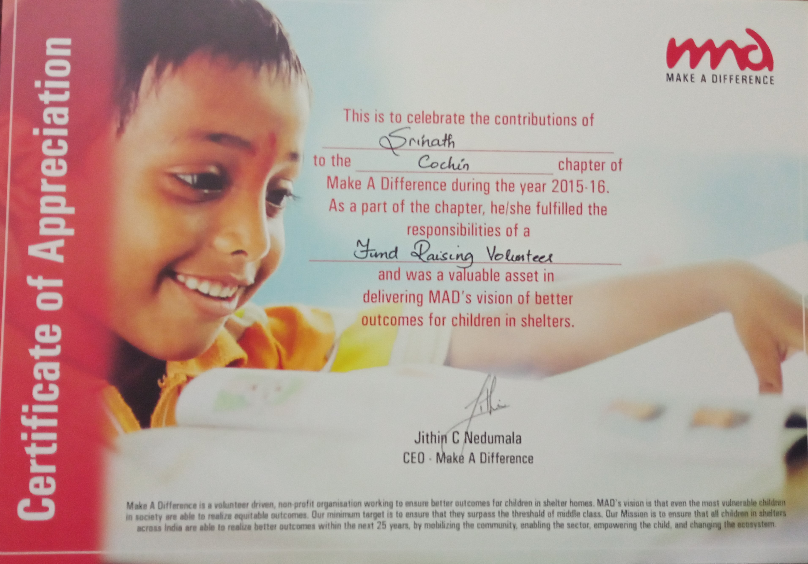

# Fundraising Intern at [Make A Difference](https://makeadiff.in/).

## Roles & responsibilties

Organised 3 major charity fundraising events in 2016:

1) `Copa De MAD` - A charity sporting event which saw a participation of `30 prestigious football teams` racing against each other for charity. The event raised around **2.3 Lakhs**.
2) `Banquet MAD` - A charity fundraising dinner at Hotel Casino, raising up to **3.5 Lakhs** for charity.
3) `MAD-A-THON` - A charity-awareness half-marathon which saw a participation of 1000 participants; marathon venue - DH Ground, Ernakulam. Funds raised - **4 Lakhs**

**All the funds raised went to the education and welfare of the children under orphanges in alliance with Make A Difference.**

## Certificate

